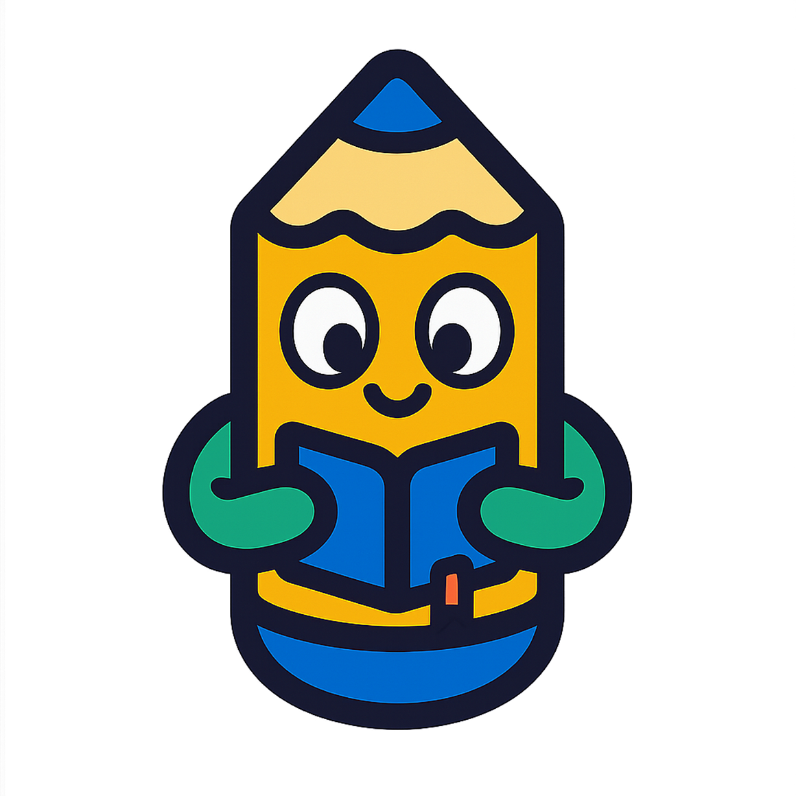
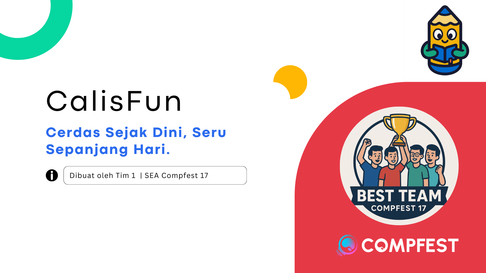
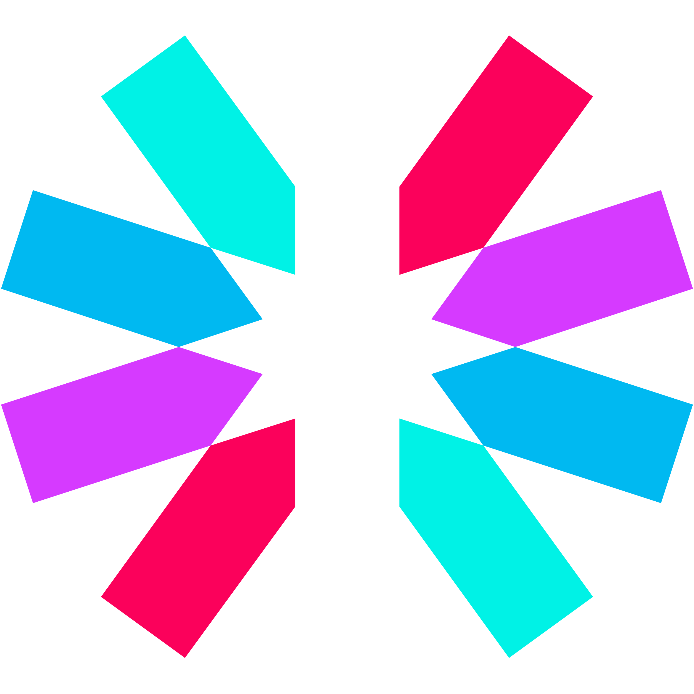
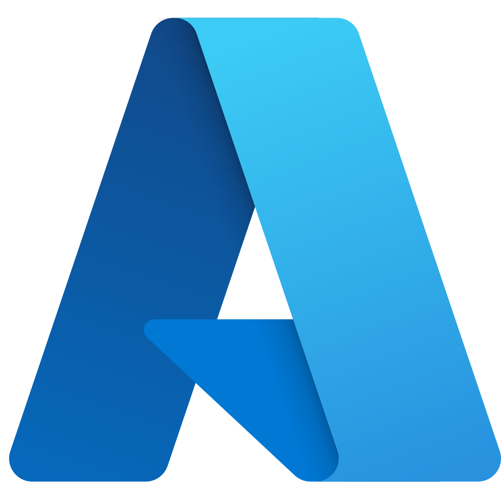
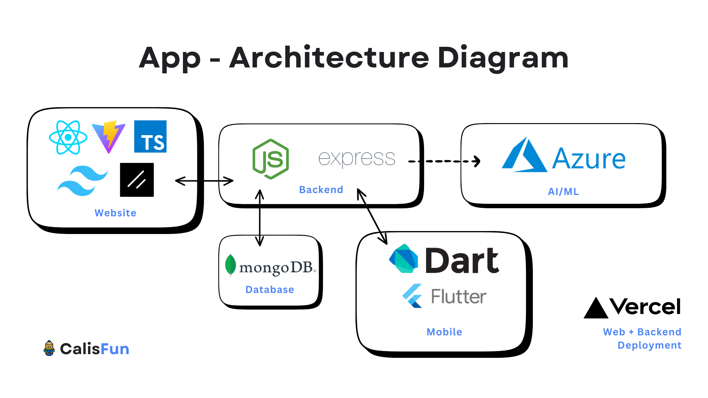
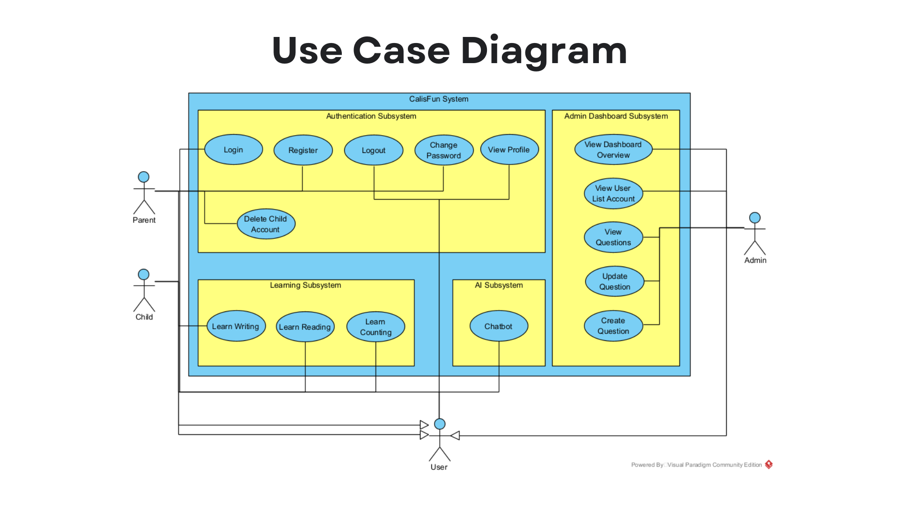
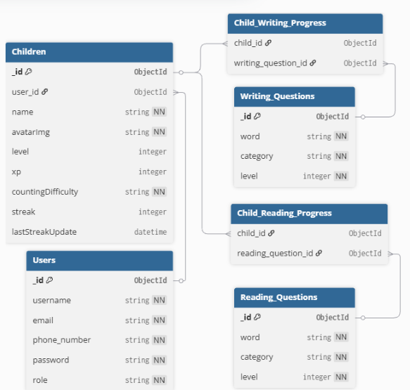

<div align="center">
    <div>
        
    </div>
    <div>
            <h3><b>CalisFun</b></h3>
            <p><i>Cerdas Sejak Dini, Seru Sepanjang Hari!</i></p>
    </div>      
</div>
<br>
<h1 align="center">CalisFun - SEA Compfest Academy 17</h1>
<div align="center">



</div>
<br>

**CalisFun** is an innovative **learning application** designed to help children practice and improve their **handwriting, spelling, and counting skills** in a fun and engaging way.  
The app combines **interactive exercises and AI-powered tools** to make learning enjoyable both for kids and supportive for parents.  

Built with a multi-platform ecosystem:
- **Mobile App (Flutter)** → Main platform for children’s learning experience.  
- **Web Frontend** → Landing page for SEO visibility, APK download, and **Admin Dashboard**.  
- **Backend (Express.js + MongoDB)** → API services for authentication, content management, and progress tracking.  
- **AI Services (Flask + Hugging Face + Azure OpenAI)** → OCR for handwriting detection and AI Chatbot assistant.  

CalisFun bridges **education and technology**, making foundational learning both **accessible and entertaining**.  

<a href="https://github.com/best-team-compfest17">CalisFun GitHub Organization - Team 1</a>

---

## 📃 Table of Contents
- [📝 CalisFun Repository Documentation](#-calisfun-repository-documentation)
- [📈 Pitch Deck](#-pitch-deck)
- [⚙️ Technology Stack](#-technology-stack)
- [🧩 Core Features](#-core-features)
- [🚀 Live App Demo](#-live-app-demo)
- [🧰 Getting Started Locally](#-getting-started-locally)
- [🚀 Diagram](#-diagram)
- [👥 Owner](#-owner)
- [📬 Contact](#-contact)

---

## 📝 CalisFun Repository Documentation

> [!TIP]
> 
> For more detail and specific documentation, please read the documentation from each of our repository

<ul>
    <li><b>Main Repository (current)</b></li>
    <a href="https://github.com/best-team-compfest17/CalisFun">https://github.com/best-team-compfest17/CalisFun</a>
    <li><b>Frontend Mobile Repository</b></li>
    <a href="https://github.com/best-team-compfest17/CalisFun-Mobile">https://github.com/best-team-compfest17/CalisFun-Mobile</a>
    <li><b>Frontend Website Repository</b></li>
    <a href="https://github.com/best-team-compfest17/CalisFun-Web">https://github.com/best-team-compfest17/CalisFun-Web</a>
    <li><b>Backend Repository</b></li>
    <a href="https://github.com/best-team-compfest17/CalisFun-Backend">https://github.com/best-team-compfest17/CalisFun-Backend</a>
    <li><b>AI Repository</b></li>
    <a href="https://github.com/best-team-compfest17/CalisFun-AI">https://github.com/best-team-compfest17/CalisFun-AI</a>
</ul>

---

## 📚 More Documenation

<ul>
    <li><b>Pitch Deck (Canva)</b></li>
    <a href="https://www.canva.com/design/DAGwNK5Gu4Q/gxKCQl_HwVlo95zU_y5Alg/edit?utm_content=DAGwNK5Gu4Q&utm_campaign=designshare&utm_medium=link2&utm_source=sharebutton">Pitch Deck - Canva</a>
    <li><b>CalisFun Application Demo Video</b></li>
    <a href="https://drive.google.com/drive/folders/1ALn_nx5Z93iAY5lw-pnxnP40bCWzajjn?usp=sharing">CalisFun Application Demo Video</a>
</ul>

---

## ⚙️ Technology Stack

### Frontend Mobile - Technology Stack

<div align="center">
<kbd></kbd>
<kbd></kbd>
<kbd></kbd>
<kbd></kbd>

</div>

<div align="center">
<h4>Flutter | Dart | Dio | Riverpod</h4>
</div>

### Backend - Technology Stack

<div align="center">

<kbd></kbd>
<kbd></kbd>
<kbd></kbd>
<kbd></kbd>
<kbd></kbd>
<kbd></kbd>
<kbd></kbd>

</div>

<div align="center">
<h4>Node JS | Express JS | MongoDB | JWT | Multer | Vercel | Microsoft Azure</h4>
</div>

<br>

### Frontend Web - Technology Stack

<div align="center">

<kbd></kbd>
<kbd></kbd>
<kbd></kbd>
<kbd></kbd>
<kbd></kbd>
<kbd></kbd>

</div>

<div align="center">
<h4>React | TypeScript | Vite | TailwindCSS | ShadcnUI | Vitest</h4>
</div>


### AI - Technology Stack


<div align="center">

<kbd></kbd>
<kbd></kbd>
<kbd></kbd>
<kbd></kbd>
<kbd></kbd>
<kbd></kbd>

</div>

<div align="center">
<h4>Python | Flask | Hugging Face | Microsoft Azure | OpenAI | Docker</h4>
</div>


---


## 🧩 Core Features

### ✍️ Handwriting Practice (AI + OCR)
- Interactive canvas for kids to practice handwriting.  
- Flutter MLKit evaluates written letters/words in real-time.  
- Provides instant realtime feedback.

### 🔡 Spelling Game
- Audio-assisted spelling learn.
- Progressive level to help children learn more about how to spell correctly. 

### 🔢 Counting Challenges
- Interactive counting mini-games.  
- Timed challenges to improve **speed and accuracy** in basic math.  

### 🏆 Leaderboard & Rewards
- Gamified leaderboard to encourage friendly competition.  
- Level up your account and earn streaks for completing daily counting exercise

### 👨‍👩‍👧 Parent Dashboard
- Parents can **track child’s progress** (handwriting accuracy, spelling scores, counting levels).  
- Manage child accounts and set study goals.

### 🌐 Web Platform
- Landing page with SEO optimization → shareable and accessible for new users.  
- Direct APK download for Android users.  
- **Admin Dashboard** for managing questions, content, and user accounts.  

### 🧠 AI-Powered Tools
- **AI Chatbot (Azure OpenAI)** → Friendly assistant for Q&A, learning support, or help navigating the app.


---


## 🚀 Live App Demo

### Frontend - Mobile Download
(please go to the Mobile Repository to download the app)

👉 [Google Drive - CalisFun Mobile Application](https://drive.google.com/drive/folders/1LYj5Aue0JOMmDMeRlu_nA0L04DEDNKlH?usp=sharing)

### Frontend - Website

👉 [https://calis-fun.vercel.app/](https://calis-fun.vercel.app/)

### Backend - Deployed API

👉 [https://calis-fun-backend.vercel.app/](https://calis-fun-backend.vercel.app/)

---

## 🧰 Getting Started Locally

### Prerequisites

General
- **Git**

Frontend - Mobile
- **Dart**
- **Flutter SDK**
- **Android Studio** (optional)

Frontend - Website
- **Node.js** (v16+)

Backend
- **Node.js** (v16+)
- **MongoDB**
- **MongoDB Compass** (optional)
- **Postman** (optional)

AI
- **Python**
- **Docker** (optional)

### Clone the Project - For each service (option 1, recommended)
```bash
Read specific README Documentation in each GitHub Repo
```

### Clone the Project - Using CalisFun Monorepo (option 2, using this repo)
```bash
git clone https://github.com/best-team-compfest17/CalisFun.git
cd CalisFun

# If prefer using shell script

./scripts/setup.sh # Pull from the origin repository (get update changes)

./scripts/dev.sh frontend-web # to run the website
./scripts/dev.sh frontend-mobile # to run the mobile (for now please just use the documentation in CalisFun-Mobile Repository)
./scripts/dev.sh backend # to run the backend
./scripts/dev.sh ai # to run the ai
./scripts/dev.sh dev # run all services

# If prefer using Makefile (configuration needed)

make init          # init submodules
make update        # update all submodules
make dev           # run all services
make frontend-web  # to run the website
make frontend-mobile # to run the mobile (for now please just use the documentation in CalisFun-Mobile Repository)
make backend # to run the backend
make ai # to run the ai

```

---

## 🧭 Diagram

*Architecture Diagram of CalisFun*
<p align="center">
  
</p>

This is how our application built on and connect cross services.

*Use Case Diagram of CalisFun*
<p align="center">
  
</p>

This is all use case that can be done in CalisFun started for user, parent, and admin role.

*Overall Database System Flow (ERD Diagram):*
<p align="center">
  
</p>

This diagram shows how the models connected using ERD Diagram

---

## 👥 Owner

This Repository is created by Team 1
<ul>
<li>Stanley Nathanael Wijaya - Fullstack Developer</li>
<li>Haikal Iman F - Mobile Developer</li>
<li>Muhammad Favian Jiwani - Mobile Developer</li>
<li>Raditya Ramadhan - Backend Developer</li>
<li>Muhammad Ridho Ananda - Mentor</li>
</ul>
As Final Project for SEA Academy Compfest 17

---

## 📬 Contact
Have questions or want to collaborate?

- 📧 Email: stanley.n.wijaya7@gmail.com
- 💬 Discord: `stynw7`

<code>Made with ❤️ by The Calon Best Team</code>